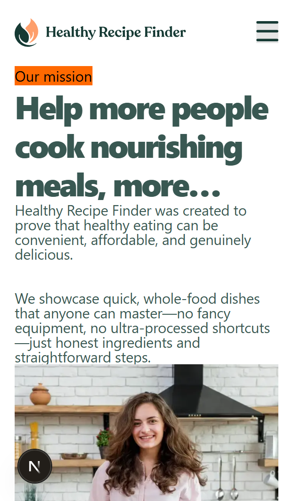
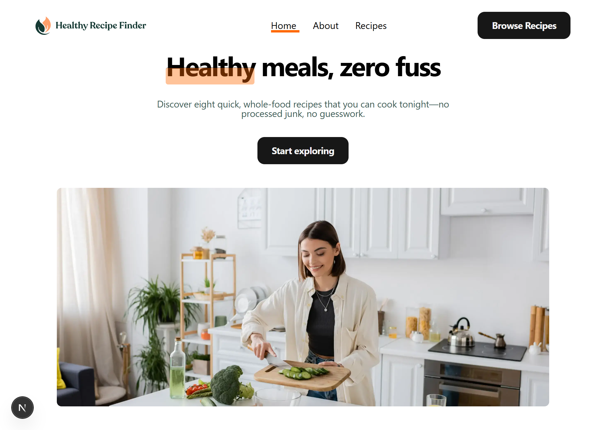
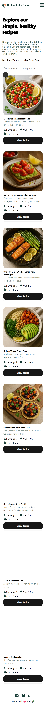
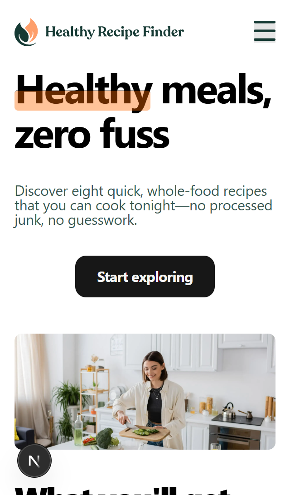

# Frontend Mentor - Recipe finder website solution

This is a solution to the [Recipe finder website challenge on Frontend Mentor](https://www.frontendmentor.io/challenges/recipe-finder-website--Ui-TZTPxN). Frontend Mentor challenges help you improve your coding skills by building realistic projects.

## Table of contents

- [Overview](#overview)
  - [The challenge](#the-challenge)
  - [Screenshot](#screenshot)
  - [Links](#links)
- [My process](#my-process)
  - [Built with](#built-with)
  - [What I learned](#what-i-learned)
  - [Continued development](#continued-development)
  - [Useful resources](#useful-resources)
- [Author](#author)
- [Acknowledgments](#acknowledgments)

## Overview

Recipe Finder is a frontend-only application built for a coding challenge to demonstrate practical skills in UI development, component design, and client-side data filtering. The project features a responsive grid layout, dynamic search functionality, reusable components, and a structured approach to managing state and rendering. The goal was to create a performant, accessible, and visually appealing interface without relying on external frameworks for backend logic.

### The challenge

Users should be able to:

- View the home, about, recipes index, and recipe detail pages
- Search for recipes by name or ingredient
- Filter recipes by max prep or cook time
- View the optimal layout for the interface depending on their device's screen size
- See hover and focus states for all interactive elements on the page

### Screenshot

### Links

- Solution URL: [Github](https://github.com/Doctorzik/recipe-finder)
- Live Site URL: [recipelook](https://recipelook.netlify.app)

## My process

I structured the development process around incremental feature implementation. I began by setting up the project scaffold and defining the core components for the recipe list, recipe card, search bar, and detail view. I then implemented client-side filtering logic to enable fast keyword-based search.

After establishing the functional flow, I focused on responsive UI design using Tailwind CSS, ensuring visual consistency across breakpoints. Additional enhancements such as hover states, transitions, and accessibility improvements were layered in afterward. The final stage involved refining state management, testing user interactions, and cleaning up the codebase for maintainability.

### Built with

- Semantic HTML5 markup
- CSS custom properties
- Flexbox
- CSS Grid
- Mobile-first workflow
- [React](https://reactjs.org/) - JS library
- [Next.js](https://nextjs.org/) - React framework
- [Tailwind Csss](https://tailwindcss.com/docs/color) - For styles

### What I learned

Improve Frontend Skills

## Author

- Website - [Add your name here](https://zik.netlify.app.com)
- Frontend Mentor - [@doctorzik](https://www.frontendmentor.io/profile/doctorzik)
- LinkedIn - [ezekieljeremiah](https://www.linkedin.com/in/jeremiahezekiel/)

